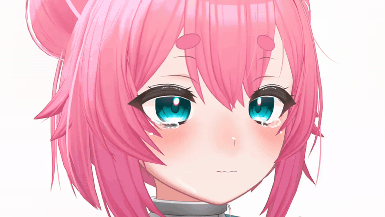
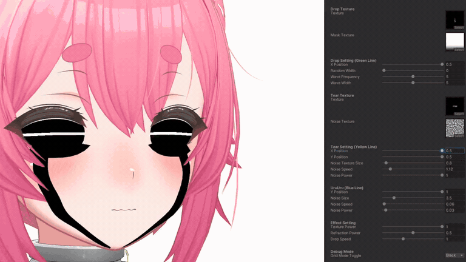
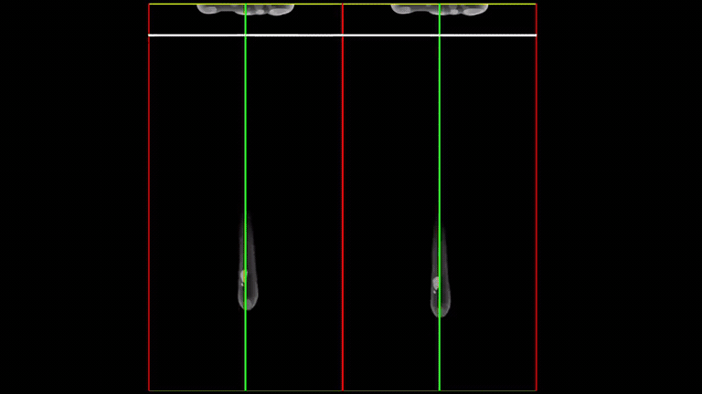

# hinasaki-shaders

A collection of Unity shaders for tears, refraction, camouflage, and holographic sights.

Originally developed as commissioned work for [@mbM0001_](https://x.com/mbM0001_). Shader development by [hjcud](https://github.com/hjcud).

## Demos

The following GIFs show the original April 2023 tear shader demonstrations. They preserve the full video durations and loop automatically. GIF previews have no audio; follow the source links for the original videos.

### Apollo tear effect

Tear droplets and the pooled tear effect on the Apollo avatar.

[Original video by @mbM0001_](https://x.com/mbM0001_/status/1645361384719540226) · 10.45 seconds

### Material controls and debugging

Adjusting the tear shader's material parameters and debug guides in Unity.

[Original video by hjcud](https://x.com/i/status/1645361618661052416) · 63.916 seconds

### 2D UV preview

A flat UV-space view of the tear animation and positioning guides.

[Original video by hjcud](https://x.com/i/status/1645361804070232065) · 46 seconds

See [media sources and conversion details](docs/media/README.md).
